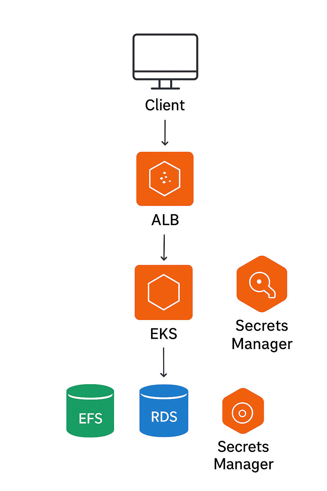
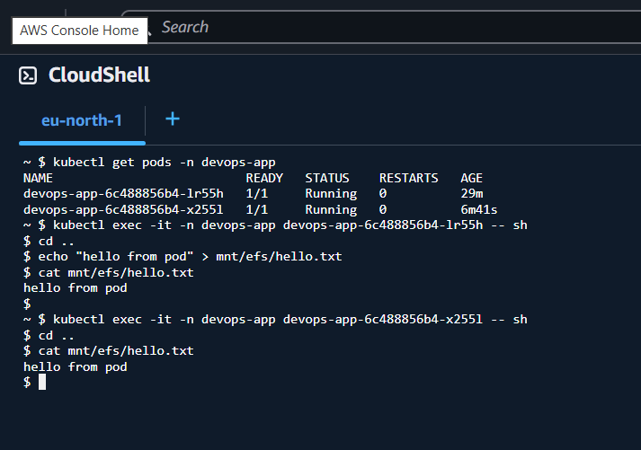
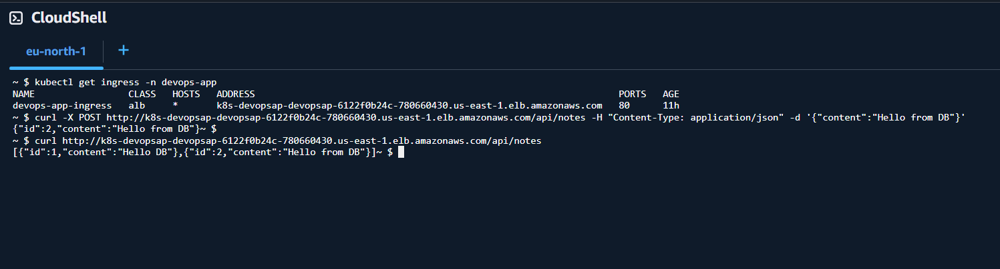

# 🚀 Terraform AWS Infrastructure for Kubernetes Application


## 📖 Overview
This project provisions a **production-ready infrastructure on AWS using Terraform**, designed to run a containerized application on **Amazon EKS** with secure storage, secrets, database, and load balancing.  

It demonstrates **Infrastructure as Code (IaC)**, **cloud-native architecture**, and **secure deployment practices**.

---

## 🔑 Key Components
- **Amazon EKS (Elastic Kubernetes Service):** Managed Kubernetes cluster for application workloads.  
- **Amazon EFS:** Mounted as persistent storage for pods.  
- **Amazon RDS (PostgreSQL):** Managed database backend.  
- **AWS Secrets Manager:** Securely stores database credentials and sensitive configuration.  
- **AWS ALB (Application Load Balancer):** Provides ingress and routing to application endpoints.  
- **VPC + Networking:** Private/public subnets, route tables, and security groups for secure communication.  

---

## 🏗️ Architecture

The following diagram shows the overall infrastructure setup on AWS:


---
# AWS-Infrastructure-Terraform
Setup Infrastructure using Terraform

## ⚡ Tech Stack
- **Terraform** (>=1.3) — Infrastructure as Code  
- **AWS Cloud** — EKS, RDS, EFS, Secrets Manager, ALB  
- **Kubernetes** — Application orchestration  
- **GitHub Actions** — CI/CD automation
  
## 🚀 Getting Started

### 🔧 Prerequisites
- Terraform installed (`>= 1.3`)
- AWS CLI configured with proper credentials (`aws configure`)
- kubectl installed for interacting with the EKS cluster

### ▶️ Deployment
```bash
# Clone the repo
git clone https://github.com/divyakantamani45/AWS-Infrastructure-Terraform.git
cd AWS-Infrastructure-Terraform

# Initialize Terraform
terraform init

# Preview changes
terraform plan -var-file=envs/prod/terraform.tfvars

# Apply infrastructure
terraform apply -var-file=envs/prod/terraform.tfvars
```
### 🗑️ Cleanup
```bash
terraform destroy -var-file=envs/prod/terraform.tfvars
```

## 📸 Demo Screenshots

### 1️⃣ EFS Mount Verification
EFS volume successfully mounted on pods inside the EKS cluster.  




### 2️⃣ Database Call via API Endpoint
API endpoint exposed through the **Application Load Balancer (ALB)** making a call to the RDS database.  



---
## 🔒 Security Highlights
- **Remote state** stored securely in S3 with DynamoDB table for state locking  
- **AWS Secrets Manager** used for database credentials and application secrets  
- **KMS encryption** enabled for RDS, EFS, and S3 buckets  
- **IAM roles** with least privilege for EKS worker nodes and Terraform execution  
- **Private subnets** for RDS and EFS, accessible only from within the VPC/EKS cluster  

---
## 📌 Future Improvements
- Add monitoring & logging with **CloudWatch, Prometheus, and Grafana**  
- Enable **autoscaling** for EKS nodes and RDS instances  
- Implement **AWS WAF** with ALB for additional security hardening  
- Add **cost optimization** features (spot instances, rightsizing, lifecycle policies)  

---

## 👨‍💻 Author
**Your Name**  
🔗 [LinkedIn](https://linkedin.com/in/divya-kantamani-51ab10353) | [Portfolio](https://your-portfolio.com) | [Email](divyakantamani1306@email.com)  


## 🌟 Why this project?
- Demonstrates **end-to-end AWS infrastructure automation** using Terraform  
- Covers **real-world cloud-native components**: Kubernetes (EKS), Database (RDS), Storage (EFS), Secrets (Secrets Manager), and Ingress (ALB)  
- Showcases **production-grade design** with networking, IAM, and encryption best practices  
- Highlights strong skills in **Terraform, AWS, Kubernetes, and secure cloud architecture**  

